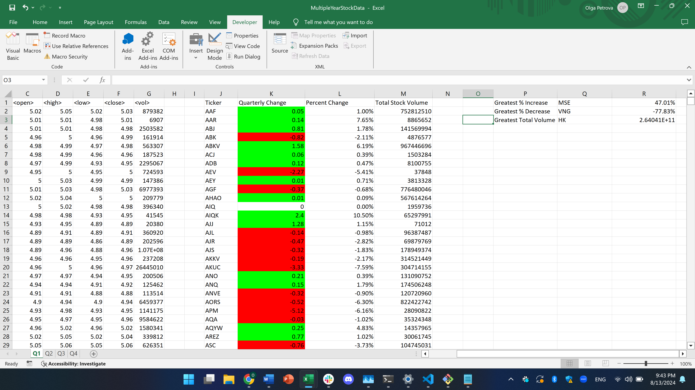

# VBA-challenge
Create a script that loops through all the stocks for each quarter and outputs the following information:

The ticker symbol

Quarterly change from the opening price at the beginning of a given quarter to the closing price at the end of that quarter.

The percentage change from the opening price at the beginning of a given quarter to the closing price at the end of that quarter.VBA-challenge
Add functionality to your script to return the stock with the "Greatest % increase", "Greatest % decrease", and "Greatest total volume". 

I wrote a program using VBA that calculates quarterly change of each stock for each quarter.
There are 4 quarters - they are represented by 4 sheets Q1, Q2, Q3, Q4.
The program calculates percentage change for every quarter and finds biggest increase and biggest decrease, also biggest stock volume.

